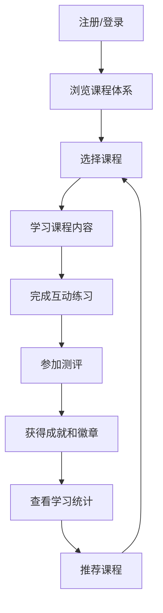

## 1. Product Overview
基于Python的数据分析在线教育平台，专为商务数据分析与应用专业学生设计，提供完整的学习体验。
- 解决商务数据分析专业学生缺乏实践机会和系统化学习路径的问题，帮助学生掌握实用的数据分析技能
- 目标市场为高等院校商务数据分析专业学生，提升其就业竞争力和专业能力

## 2. Core Features

### 2.1 User Roles
| Role | Registration Method | Core Permissions |
|------|---------------------|------------------|
| 免费用户 | 邮箱注册 | 浏览课程、参与练习、查看基本成就 |
| 管理员 | 后台添加 | 管理课程内容、用户数据、系统设置 |

### 2.2 Feature Module
1. **首页**：课程体系概览、学习进度、推荐课程、成就展示
2. **课程页**：课程详情、章节内容、学习资源
3. **练习页**：互动练习、实时反馈、练习历史
4. **测评页**：在线测试、成绩分析、证书生成
5. **成就页**：徽章系统、学习统计、排行榜

### 2.3 Page Details
| Page Name | Module Name | Feature description |
|-----------|-------------|---------------------|
| 首页 | 课程体系概览 | 展示完整的课程体系结构，包括基础、进阶、专业三个层次 |
| 首页 | 学习进度 | 实时显示用户当前学习进度和完成情况 |
| 首页 | 推荐课程 | 根据用户学习历史和兴趣推荐相关课程 |
| 首页 | 成就展示 | 展示用户获得的徽章和成就 |
| 课程页 | 课程详情 | 显示课程介绍、目标、适用人群等信息 |
| 课程页 | 章节内容 | 提供视频、文档、代码示例等学习资源 |
| 课程页 | 学习资源 | 提供Python代码、数据集、工具下载 |
| 练习页 | 互动练习 | 提供编程练习、数据分析任务等实践机会 |
| 练习页 | 实时反馈 | 对用户提交的代码和分析结果提供即时反馈 |
| 练习页 | 练习历史 | 记录用户练习历史和完成情况 |
| 测评页 | 在线测试 | 提供章节测试和综合测评 |
| 测评页 | 成绩分析 | 分析用户测试结果，提供改进建议 |
| 测评页 | 证书生成 | 完成课程后生成电子证书 |
| 成就页 | 徽章系统 | 根据学习进度和成就发放徽章 |
| 成就页 | 学习统计 | 提供学习时长、完成课程数等统计数据 |
| 成就页 | 排行榜 | 展示用户在学习社区中的排名 |

## 3. Core Process
用户注册登录后，首先浏览课程体系，选择感兴趣的课程开始学习。学习过程中，完成互动练习和测评，获得成就和徽章。系统根据用户学习情况推荐后续课程，形成完整的学习闭环。

## 4. User Interface Design
### 4.1 Design Style
- 主色调：蓝色系 (#1E40AF) 和绿色系 (#10B981)，代表专业和成长
- 辅助色：橙色 (#F59E0B)，用于强调和引导
- 按钮风格：圆角矩形，有轻微的3D效果
- 字体：无衬线字体，主标题使用18-24px，正文使用14-16px
- 布局风格：卡片式布局，清晰的信息层次
- 图标风格：扁平化图标，搭配适当的动效

### 4.2 Page Design Overview
| Page Name | Module Name | UI Elements |
|-----------|-------------|-------------|
| 首页 | 课程体系概览 | 三级课程卡片，带有进度条和难度标识，使用蓝色渐变背景 |
| 首页 | 学习进度 | 环形进度图，显示总体完成情况，搭配数字统计 |
| 首页 | 推荐课程 | 横向滚动卡片，带有课程缩略图和评分 |
| 首页 | 成就展示 | 徽章网格布局，获得的徽章高亮显示 |
| 课程页 | 课程详情 | 顶部banner，包含课程标题和简介，下方为章节列表 |
| 课程页 | 章节内容 | 视频播放器、代码编辑器、文档阅读器，响应式布局 |
| 练习页 | 互动练习 | 代码编辑区，实时运行按钮，结果展示区 |
| 测评页 | 在线测试 | 选择题、填空题、编程题等多种题型，进度指示器 |
| 成就页 | 徽章系统 | 徽章展示墙，悬停显示详细信息，动画效果 |

### 4.3 Responsiveness
采用移动优先的响应式设计，适配桌面端、平板和手机设备。在小屏幕设备上优化布局，确保核心功能可用。

### 4.4 3D Scene Guidance
不适用，本项目为教育平台，不需要3D场景。