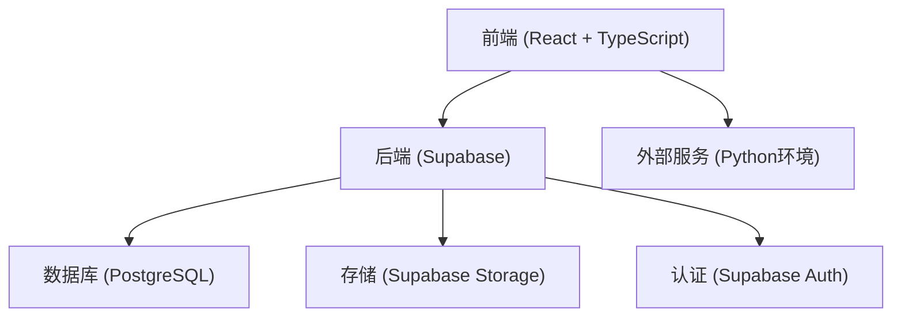
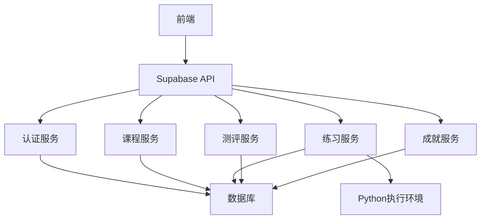
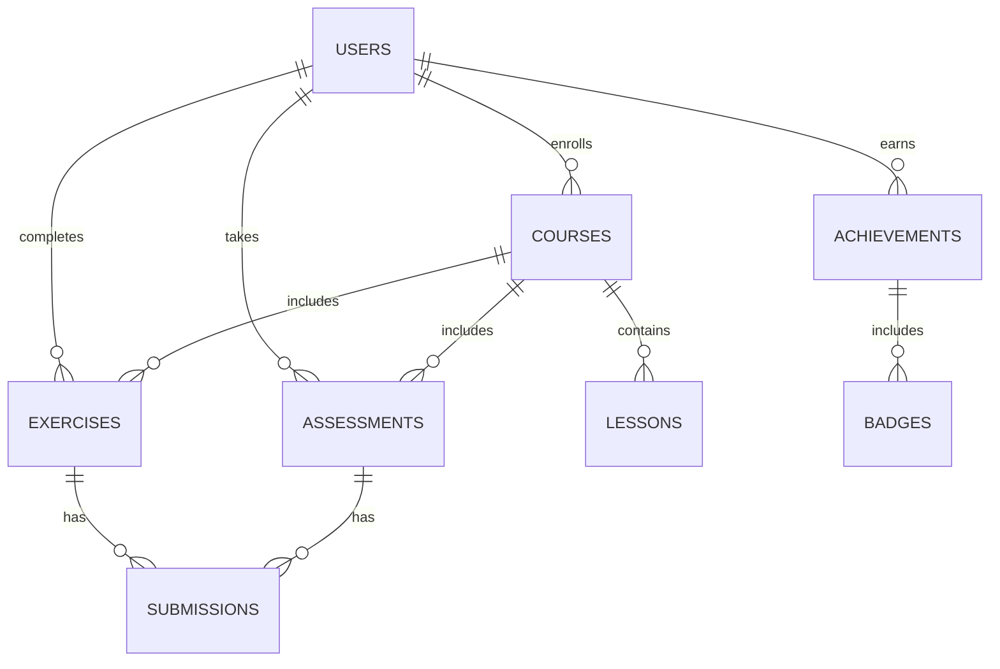

## 1. Architecture Design


## 2. Technology Description
- 前端：React@18 + TypeScript + Tailwind CSS@3 + Vite
- 初始化工具：Vite
- 后端：Supabase (提供认证、数据库、存储服务)
- 数据库：Supabase (PostgreSQL)
- 外部服务：Python环境 (用于代码执行和数据分析)

## 3. Route Definitions
| Route | Purpose |
|-------|---------|
| / | 首页，展示课程体系和学习进度 |
| /courses | 课程列表页 |
| /courses/:id | 课程详情页 |
| /courses/:id/lessons/:lessonId | 章节内容页 |
| /exercises | 练习页面 |
| /exercises/:id | 具体练习页 |
| /assessments | 测评页面 |
| /assessments/:id | 具体测评页 |
| /achievements | 成就页面 |
| /profile | 用户个人资料页 |
| /login | 登录页 |
| /register | 注册页 |

## 4. API Definitions
### 4.1 认证相关
- 注册：`POST /auth/signup` - 创建新用户
- 登录：`POST /auth/signin` - 用户登录
- 登出：`POST /auth/signout` - 用户登出

### 4.2 课程相关
- 获取课程列表：`GET /courses` - 获取所有课程
- 获取课程详情：`GET /courses/:id` - 获取指定课程详情
- 获取章节内容：`GET /courses/:id/lessons/:lessonId` - 获取指定章节内容

### 4.3 练习相关
- 获取练习列表：`GET /exercises` - 获取所有练习
- 获取练习详情：`GET /exercises/:id` - 获取指定练习详情
- 提交练习：`POST /exercises/:id/submit` - 提交练习答案
- 获取练习历史：`GET /exercises/history` - 获取用户练习历史

### 4.4 测评相关
- 获取测评列表：`GET /assessments` - 获取所有测评
- 获取测评详情：`GET /assessments/:id` - 获取指定测评详情
- 提交测评：`POST /assessments/:id/submit` - 提交测评答案
- 获取测评结果：`GET /assessments/:id/result` - 获取测评结果

### 4.5 成就相关
- 获取用户成就：`GET /achievements` - 获取用户成就列表
- 获取排行榜：`GET /achievements/leaderboard` - 获取学习排行榜

## 5. Server Architecture Diagram


## 6. Data Model
### 6.1 Data Model Definition


### 6.2 Data Definition Language
#### 用户表
```sql
CREATE TABLE users (
  id UUID PRIMARY KEY,
  email TEXT UNIQUE NOT NULL,
  name TEXT,
  created_at TIMESTAMP DEFAULT NOW(),
  last_login TIMESTAMP
);
```

#### 课程表
```sql
CREATE TABLE courses (
  id UUID PRIMARY KEY,
  title TEXT NOT NULL,
  description TEXT,
  level TEXT NOT NULL, -- basic, intermediate, advanced
  duration INTEGER, -- in hours
  created_at TIMESTAMP DEFAULT NOW(),
  updated_at TIMESTAMP
);
```

#### 章节表
```sql
CREATE TABLE lessons (
  id UUID PRIMARY KEY,
  course_id UUID REFERENCES courses(id),
  title TEXT NOT NULL,
  content TEXT,
  video_url TEXT,
  order_index INTEGER,
  created_at TIMESTAMP DEFAULT NOW()
);
```

#### 练习表
```sql
CREATE TABLE exercises (
  id UUID PRIMARY KEY,
  course_id UUID REFERENCES courses(id),
  title TEXT NOT NULL,
  description TEXT,
  difficulty TEXT,
  solution TEXT,
  created_at TIMESTAMP DEFAULT NOW()
);
```

#### 测评表
```sql
CREATE TABLE assessments (
  id UUID PRIMARY KEY,
  course_id UUID REFERENCES courses(id),
  title TEXT NOT NULL,
  description TEXT,
  passing_score INTEGER,
  created_at TIMESTAMP DEFAULT NOW()
);
```

#### 成就表
```sql
CREATE TABLE achievements (
  id UUID PRIMARY KEY,
  name TEXT NOT NULL,
  description TEXT,
  icon TEXT,
  requirement TEXT,
  created_at TIMESTAMP DEFAULT NOW()
);
```

#### 用户课程关联表
```sql
CREATE TABLE user_courses (
  id UUID PRIMARY KEY,
  user_id UUID REFERENCES users(id),
  course_id UUID REFERENCES courses(id),
  progress INTEGER DEFAULT 0, -- percentage
  completed BOOLEAN DEFAULT FALSE,
  enrolled_at TIMESTAMP DEFAULT NOW()
);
```

#### 用户练习提交表
```sql
CREATE TABLE exercise_submissions (
  id UUID PRIMARY KEY,
  user_id UUID REFERENCES users(id),
  exercise_id UUID REFERENCES exercises(id),
  code TEXT,
  result TEXT,
  score INTEGER,
  submitted_at TIMESTAMP DEFAULT NOW()
);
```

#### 用户测评提交表
```sql
CREATE TABLE assessment_submissions (
  id UUID PRIMARY KEY,
  user_id UUID REFERENCES users(id),
  assessment_id UUID REFERENCES assessments(id),
  answers JSONB,
  score INTEGER,
  passed BOOLEAN,
  submitted_at TIMESTAMP DEFAULT NOW()
);
```

#### 用户成就表
```sql
CREATE TABLE user_achievements (
  id UUID PRIMARY KEY,
  user_id UUID REFERENCES users(id),
  achievement_id UUID REFERENCES achievements(id),
  earned_at TIMESTAMP DEFAULT NOW()
);
```